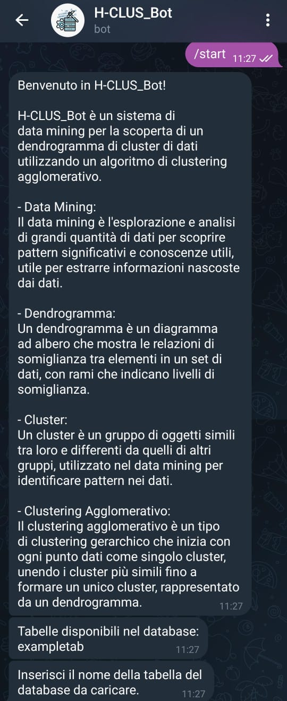

# MANUALE UTENTE H-CLUS

## INDICE


[1.Introduzione](#1-introduzione)
- [1.2 Obiettivi](#12-obiettivi-del-progetto)

[2. Istruzioni per l'installazione](#2-istruzioni-per-linstallazione)
- [2.1 Configurazione del server H-CLUS](#21-configurazione-del-server-h-clus)

[3. Istruzioni per l'esecuzione](#3-istruzioni-per-lesecuzione)
- [3.1 Esecuzione del server H-CLUS](#31-esecuzione-del-server-h-clus)
- [3.2 Esecuzione del bot telegram H-CLUS](#32-esecuzione-del-bot-telegram-h-clus)

[4. Istruzioni per l'uso](#4-istruzioni-per-luso)

[5. Modello UML](#5-modello-uml)

[6. Java doc](#6-javadoc)

[7. Contatti](#7-contatti)


## **1. Introduzione**

Il progetto H-CLUS, sviluppato nell'ambito del corso di Metodi Avanzati di Programmazione (Anno Accademico 2023-24), si propone di implementare un sistema client-server per il clustering gerarchico di dati.

### 1.2 Obiettivi del Progetto

L'obiettivo principale del progetto è la realizzazione di un sistema denominato "H-CLUS", il quale include le seguenti componenti:
- **Server**: Modulo responsabile dell'applicazione di algoritmi di data mining per la scoperta di dendrogrammi di cluster di dati utilizzando tecniche di clustering agglomerativo.
- **Client**: Un Bot Telegram che consente agli utenti di accedere ai servizi di scoperta remota offerti dal server e visualizzare i cluster di dati identificati.

## **2. Istruzioni per l'installazione**

Per installare il software H-CLUS, è necessario seguire i seguenti passaggi:

1. **Scaricare e Installare Java Development Kit (JDK):**
   - Assicurarsi di avere installato il JDK versione 11 o successiva. È possibile scaricarlo dal sito ufficiale di Oracle.
     - [Scarica JDK da Oracle](https://www.oracle.com/java/technologies/javase-jdk11-downloads.html)

2. **Scaricare e Installare MySQL:**
   - Installare MySQL Community Server. È possibile scaricarlo dal sito ufficiale di MySQL.
     - [Scarica MySQL Community Server](https://dev.mysql.com/downloads/mysql/)

3. **Inserire MySQL tra le variabili d'ambiente:**
  - Aprire il menu `Start` e cercare "variabili d'ambiente".

  - Selezionare `Modifica le variabili d'ambiente di sistema`.

  - Nella finestra `Proprietà del sistema`, cliccare su `Variabili d'ambiente...`.

  - Nella sezione `Variabili di sistema`, cercare e selezionare la variabile `Path`, quindi cliccare su `Modifica...`.

  - Cliccare su `Nuovo` e aggiungere il percorso della cartella `bin` di MySQL. Il percorso predefinito è solitamente: `C:\Program Files\MySQL\MySQL Server [versione]\bin`

  - Cliccare su `OK` per chiudere tutte le finestre aperte.

4. **Verificare l'installazione**

  - Aprire un nuovo prompt dei comandi.

  - Digitare `mysql --version` e premere `Invio`.

  - Se MySQL è stato aggiunto correttamente al `PATH`, vedrai la versione di MySQL installata.


### **2.1 Configurazione del server H-CLUS**

Nella directory principale del progetto, individuare il file `server_setup.bat`. 

Prima di avviare il file `server_setup.bat`, modificare il file sostituendo i valori dei campi username e password con le credenziali del proprio account amministratore di MySQL.

Infine, seguire questi passaggi per eseguirlo:

### Esecuzione del file batch `server_setup.bat`

- **Metodo 1: Doppio clic**
  - Individuare il file `server_setup.bat` nella directory del progetto.
  - Fare doppio clic sul file `server_setup.bat` per eseguirlo.

- **Metodo 2: Da terminale**
  - Aprire un terminale o prompt dei comandi.
  - Navigare alla directory dove si trova il file `server_setup.bat`.
  - Eseguire il comando:
    ```sh
    server_setup.bat
    ```

### Descrizione delle funzionalità del file batch

Il file batch eseguirà i seguenti passaggi:

1. **Configurazione delle variabili di progetto:** Imposta variabili per i percorsi dei file e delle directory utilizzate nel progetto.
2. **Esecuzione del file SQL:** Esegue uno script SQL per configurare il database utilizzando MySQL.
3. **Compilazione del server:** Compila i file sorgente Java presenti nella directory `src` e li posiziona nella directory `out`.
4. **Creazione del file JAR:** Crea un file JAR eseguibile che include il server e tutte le dipendenze necessarie.
5. **Generazione della documentazione Javadoc:** Genera la documentazione Javadoc per il progetto.

## **3. Istruzioni per l'esecuzione**

### **3.1 Esecuzione del server H-CLUS**

Nella directory principale del progetto, individuare il file `server_run.bat`. 

Prima di avviare il file `server_run.bat`, modificare il file sostituendo il valore del campo port col numero di porta sul quale avviare il server.

Lasciare invariato il campo se si preferisce utilizzare il valore di default.

Infine, seguire questi passaggi per eseguirlo:
### Esecuzione del file batch `server_run.bat`

- **Metodo 1: Doppio clic**
  - Individuare il file `server_run.bat` nella directory del progetto.
  - Fare doppio clic sul file `server_run.bat` per eseguirlo.

- **Metodo 2: Da terminale**
  - Aprire un terminale o prompt dei comandi.
  - Navigare alla directory dove si trova il file `server_run.bat`.
  - Eseguire il comando:
    ```sh
    server_run.bat
    ```
**NB:** E' possibile avere aperto un unico **Server** alla volta, infatti il sistema impedirà di aprirne più di uno contemporaneamente. Per questo motivo fare attenzione quando si prova a chiudere il terminale del server: usare la combinazione __CTRL+C__ invece di chiudere direttamente il terminale perchè altrimenti il processo java rimarrà ancora in esecuzione (in quel caso bisogna terminare il processo dal task manager)! 

### Descrizione delle funzionalità del file batch

Il file batch eseguirà il file JAR del server con la porta specificata.

### **3.2 Esecuzione del Bot Telegram H-CLUS**

Una volta recati nell'applicazione "Telegram" cercare come utente: @HCLUS_Bot oppure accedere al bot tramite questo [link](https://t.me/HCLUS_Bot).

N.B: E' possibile avere più chat attive del **Bot** contemporaneamente.

### Esecuzione del bot @HCLUS_Bot

- **Metodo 1: Da tastiera**
    - Scrivere il comando **/start** in chat.

- **Metodo 2: Da menu**
    - Cliccare il pulsante **/start** nel menu della chat.

### Chiusura della connessione con il server
È possibile chiudere la connessione al server in modo controllato prima di completare le operazioni di mining. 

Per farlo:
- **Metodo 1: Da tastiera**
    - Scrivere il comando **/end** in chat.

- **Metodo 2: Da menu**
    - Cliccare il pulsante **/end** nel menu della chat.

## **4. Istruzioni per l'uso**

### Prima volta nella chat:
<p style="text-align: center;width: 500px; height: 500px;">
    
</p>

---

### Schermata di avvio del bot:

<p style="text-align: center;width: 500px; height: 600px;">
    
</p>

---

### Inserimento di testo o comandi prima di instaurare una connessione

<p style="text-align: center;width: 500px; height: 600px;">
    
</p>

---
### Inserimento di un nome di tabella non valido

<p style="text-align: center;width: 500px;">
    
</p>
Il programma ci dirà che la tabella non è stata trovata e ci dara la possibilità di inserire un'altro nome.

---
### ### Inserimento di un nome di tabella valido

<p style="text-align: center; width: 500px;">
    
</p>

---
### Inserimento di una scelta diversa da 1 o 2

<p style="text-align: center; width: 500px;">
    
</p>

---
### Scelta 1

Se inseriamo 1 avremo scelto il caricamento del dendrogramma da file: 

<p style="text-align: center; width: 500px;">
    
</p>

---
### Inserimento del nome di un file che non esiste

<p style="text-align: center; width: 500px;">
    
</p>

---
### Inserimento del nome di un file senza estensione
<p style="text-align: center;width: 500px;">
    
</p>

---
### Inserimento del nome di un file valido

<p style="text-align: center;width: 500px; height: 500px;">
    
</p>

---
### Scelta 2
Se inseriamo 2 avremo scelto l'opzione apprendi dendrogramma dal database:

<p style="text-align: center; width: 500px;">
    
</p>

---
### Inserimento di una profondità non valida

<p style="text-align: center; width: 500px;">
    
</p>

---
### Se inseriamo una profondità corretta (da 1 a 5)

<p style="text-align: center; width: 500px;">
    
</p>


---
### Inserimento distanza non valida

<p style="text-align: center; width: 500px;">
    
</p>

---
### Inserimento distanza valida 1
Se inseriamo una scelta corretta (1 o 2):

<p style="text-align: center; width: 500px; height: 500px;">
    
</p>

---
### Inserimento del nome di un file valido

<p style="text-align: center; width: 500px;">
    
</p>

---
### Inserimento distanza valida 2
Se inseriamo una scelta corretta (1 o 2):

<p style="text-align: center; width: 500px; height: 500px;">
    
</p>

---
### Inserimento del nome di un file valido

<p style="text-align: center; width: 500px;">
    
</p>

---

### Inserimento del nome del file senza estensione

<p style="text-align: center; width: 500px;">
    
</p>

---

### Chiusura del programma:

<p style="text-align: center; width: 500px;">
    
</p>

---

## **5. Modello UML**

### UML BOT TELEGRAM
<p style="text-align: center;">
    
</p>

### UML SERVER COMPLETO
<p style="text-align: center;">
    
</p>

### UML PACKAGE SERVER
<p style="text-align: center;">
    
</p>

### UML PACKAGE CLUSTERING
<p style="text-align: center;">
    
</p>

### UML PACKAGE DISTANCE
<p style="text-align: center;">
    
</p>

### UML PACKAGE DATA
<p style="text-align: center;">
    
</p>

### UML PACKAGE DATABASE 
<p style="text-align: center;">
    
</p>

---
## **6. JavaDoc**

Per accedere alla documentazione JavaDoc del progetto, fare clic sui link sottostanti:

- [JavaDoc del Server](./Server/server_javadoc/index.html)


## **7. Contatti**

Per ulteriori informazioni, contattare:

- **Ferrara Marco**: m.ferrara62@studenti.uniba.it;
- **Appice Lorenzo**: l.appice@studenti.uniba.it;
- **De giglio Pietro**: p.degiglio5@studenti.uniba.it;

